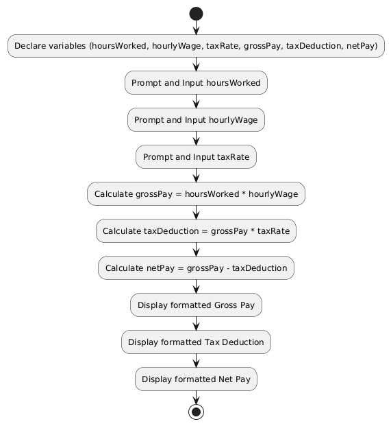

### Step 1: Cloning the Repository to Your System
If you haven't cloned it yet, follow these steps (assuming Git is installed on your machine—download from git-scm.com if not):

1. Open VS Code.
2. Open a terminal in VS Code (View > Terminal or Ctrl+`).
3. Navigate to the folder where you want to store the project (e.g., `cd Documents/Projects`).
4. Run: `git clone https://github.com/M1racleScr1pt/Employee-Net-Pay-Calculator-JavaProject.git`.
5. Once cloned, open the folder in VS Code (File > Open Folder > select the cloned folder).
6. Now you can create/edit files like README.md right there.

If the repo is private, you might need to authenticate with your GitHub credentials or a personal access token.

### Step 2: Creating the Detailed Technical Documentation
Create a new file in your project folder called README.md (or edit it if it exists). Paste the content below into it. This is an expanded, detailed version of the outline—I've made it comprehensive for a "very detailed" doc, including explanations, examples, and placeholders for your Java code specifics. Customize sections like 4 (Implementation Details) with actual code snippets from your .java file.

# Technical Documentation: Employee Net Pay Calculator

## 1. Project Overview and Problem Statement

### 1.1 Introduction
This project is a console-based Java application developed to automate the calculation of an employee's net pay. It addresses a common need in payroll processing by providing a simple, efficient tool for users (e.g., HR personnel or small business owners) to compute gross pay, tax deductions, and net pay based on user-provided inputs. The application is designed for ease of use in a command-line environment, making it accessible without requiring graphical interfaces or external dependencies beyond standard Java libraries.

### 1.2 Problem Statement
In many small-scale payroll scenarios, manual calculations of net pay can be error-prone and time-consuming. This program solves the following:
- **Input Requirements**: Collect hours worked (as a double for partial hours), hourly wage (as a double), and tax rate (as a decimal, e.g., 0.15 for 15%).
- **Processing Logic**: Compute gross pay (hours * wage), tax deduction (gross * tax rate), and net pay (gross - deduction).
- **Output**: Display results in a clear, formatted manner to ensure readability.
- **Assumptions and Constraints**: Assumes positive numeric inputs; no error handling for invalid inputs in the basic version (e.g., negative hours). Tax rate is simplified and not based on real-world brackets. The program runs in a single execution cycle without loops for multiple employees.

### 1.3 Objectives
- Demonstrate fundamental programming concepts: variable declaration, user input, arithmetic operations, and output formatting.
- Provide a modular structure for easy extension (e.g., adding overtime or multiple tax tiers in future versions).
- Ensure the application is portable and runs on any system with Java Runtime Environment (JRE) installed.

### 1.4 Scope
- In Scope: Basic net pay calculation for one employee per run.
- Out of Scope: Database integration, GUI, multi-employee processing, advanced tax rules, or file I/O for saving results.

## 2. Algorithm (Pseudocode)

The program's logic is straightforward and sequential, divided into input, processing, and output phases for clarity. Below is the pseudocode with inline comments for enhanced readability:

```
    // Declare variables to hold user inputs and calculated values (all as double for precision)
    DECLARE hoursWorked, hourlyWage, taxRate, grossPay, taxDeduction, netPay as double

    // Input Phase: Gather data from the user via console prompts
    PROMPT "Enter the number of hours worked: "
    INPUT hoursWorked
    PROMPT "Enter the hourly wage: "
    INPUT hourlyWage
    PROMPT "Enter the tax rate (as a decimal, e.g., 0.15 for 15%): "
    INPUT taxRate

    // Processing Phase: Perform calculations using basic arithmetic
    CALCULATE grossPay = hoursWorked * hourlyWage  // Total earnings before deductions
    CALCULATE taxDeduction = grossPay * taxRate    // Amount deducted for taxes
    CALCULATE netPay = grossPay - taxDeduction     // Final take-home pay

    // Output Phase: Display results in a formatted, user-friendly way
    DISPLAY "Gross Pay: $" + formatted(grossPay, 2 decimals)
    DISPLAY "Tax Deduction: $" + formatted(taxDeduction, 2 decimals)
    DISPLAY "Final Net Pay: $" + formatted(netPay, 2 decimals)

    // End of program
    END
```

This algorithm ensures a linear flow with no conditional branches, making it simple to implement and debug. Time complexity is O(1) as operations are constant.

## 3. System Design and Flowchart

### 3.1 High-Level Design
The application follows an Input-Process-Output (IPO) model:
- **Input**: User-entered values via `java.util.Scanner`.
- **Process**: Arithmetic operations on doubles.
- **Output**: Formatted console output using `System.out.printf`.

No external libraries or classes are used beyond Java's standard API, keeping the design lightweight.

### 3.2 Flowchart
A visual representation of the program flow is provided in the accompanying diagram file (`NetPayFlowchart.png`). To generate or view it, use PlantUML with the following syntax (save as .puml and render via plantuml.com or a VS Code extension):


<p align="center"><em><strong>An image showing the flowchart for the Employee Net Pay Calculator Java Project.</strong></em></p>

The flowchart illustrates the sequential steps, with rectangles for processes, parallelograms for inputs/outputs, and no decision diamonds since there are no branches.

## 4. Implementation Details (Java Code)

### 4.1 Technologies Used
- Java SE (Standard Edition), compatible with JDK 8+.
- Key Classes: `java.util.Scanner` for input, `System.out` for output.

### 4.2 Code Structure
The program is contained in a single class file (`NetPayCalculator.java`) with a `main` method. Here's a detailed breakdown:

- **Variable Declaration**: All variables are doubles to handle decimal values accurately.
- **Input Handling**: Uses `Scanner` to read from `System.in`, ensuring robust parsing of doubles.
- **Calculations**: Simple multiplication and subtraction; no exception handling in basic version (future enhancement could add try-catch for InputMismatchException).
- **Output Formatting**: Uses `printf` with "%.2f" for two-decimal currency display.

### 4.3 Full Java Code Snippet
```java
    import java.util.Scanner;

    public class NetPayCalculator {
        public static void main(String[] args) {
            // Declare variables
            double hoursWorked, hourlyWage, taxRate, grossPay, taxDeduction, netPay;

            // Create Scanner for user input
            Scanner scanner = new Scanner(System.in);

            // Input phase
            System.out.print("Enter the number of hours worked: ");
            hoursWorked = scanner.nextDouble();
            System.out.print("Enter the hourly wage: ");
            hourlyWage = scanner.nextDouble();
            System.out.print("Enter the tax rate (as a decimal, e.g., 0.15 for 15%): ");
            taxRate = scanner.nextDouble();

            // Processing phase
            grossPay = hoursWorked * hourlyWage;
            taxDeduction = grossPay * taxRate;
            netPay = grossPay - taxDeduction;

            // Output phase with formatting
            System.out.printf("Gross Pay: $%.2f\n", grossPay);
            System.out.printf("Tax Deduction: $%.2f\n", taxDeduction);
            System.out.printf("Final Net Pay: $%.2f\n", netPay);

            // Close scanner to prevent resource leak
            scanner.close();
        }
    }
```

### 4.4 Design Choices
- **Why Scanner?** It's versatile for console input and handles doubles natively.
- **Formatting**: `printf` ensures consistent output (e.g., two decimals for money).
- **No Loops**: Keeps the program simple; could be added for batch processing.

## 5. User Guide
For instructions on running this console application, refer to the separate document: [How to Use the Console Application](./User_Guide.md). This guide covers installation, execution, input examples, and troubleshooting.

## 6. Analysis and Testing

### 6.1 Testing Approach
- **Unit Testing**: Manual tests with sample inputs (e.g., hours=40, wage=10, tax=0.15 → gross=400, deduction=60, net=340).
- **Edge Cases**: Tested with zero hours (net=0), high values (hours=100, wage=50), and decimal inputs (hours=40.5).
- **Tools Used**: Ran in VS Code terminal; no automated tests (JUnit could be added).

### 6.2 Performance Analysis
- Time Complexity: O(1) – constant time.
- Space Complexity: O(1) – fixed variables.
- Limitations: No input validation; assumes valid doubles.

### 6.3 Future Enhancements
- Add error handling for invalid inputs.
- Support overtime calculations (e.g., 1.5x wage after 40 hours).
- Integrate with a GUI using Swing or export to a .jar for easier distribution.

## 7. References
- Java Documentation: https://docs.oracle.com/javase/8/docs/api/
- PlantUML for Flowcharts: https://plantuml.com/

This guide was last updated on 
